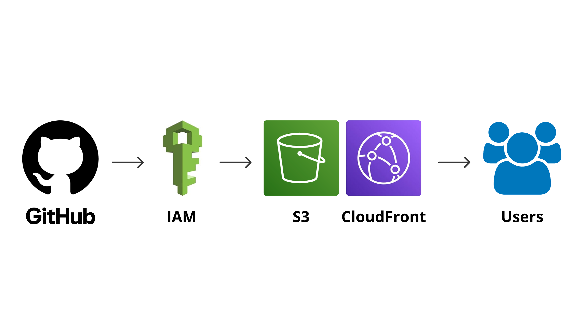

# Secure Cloud Portfolio: A DevSecOps Baseline

**Live Demo:** [https://d2yqbla2cm6dpf.cloudfront.net/](https://d2yqbla2cm6dpf.cloudfront.net/)

## The Objective
I transitioned into Cloud Engineering from a background in physical architecture and cyber awareness design. In my previous roles, I analyzed how systems break and taught enterprises how to defend them. Now, I build the infrastructure myself. 

This project serves as a live demonstration of my baseline technical capabilities in **Cloud Hosting**, **Security/IAM**, and **CI/CD Automation**. The goal was to deploy a static web application using modern, enterprise-grade security practices, avoiding legacy "quick fixes" like public S3 buckets or long-lived permanent access keys.

## Architecture Flow

1. **Version Control:** Code is maintained in Git and pushed to GitHub.
2. **CI/CD Pipeline:** GitHub Actions automatically tests, authenticates, and deploys the code.
3. **Storage:** AWS S3 acts as the origin storage for static assets.
4. **Content Delivery:** AWS CloudFront distributes the content globally for low-latency access.
5. **Security:** CloudFront Origin Access Control (OAC) ensures the S3 bucket is strictly private and only accessible via the CDN.

## Security Implementations (The "Sec" in DevSecOps)
I intentionally built this project using the Principle of Least Privilege:
* **Identity Federation (OIDC):** Instead of storing permanent AWS Access Keys in GitHub (a major security risk), I configured an OpenID Connect (OIDC) identity provider. GitHub assumes a temporary, short-lived IAM role to perform deployments.
* **Origin Access Control (OAC):** The S3 bucket blocks all public internet traffic. The bucket policy only permits `s3:GetObject` requests originating from the specific CloudFront Distribution ID.
* **Encrypted Transit:** CloudFront forces HTTPS redirects, ensuring secure data transit to the end user.

## CI/CD Automation
Manual deployments are prone to human error. I wrote a YAML workflow in GitHub Actions to automate the deployment lifecycle. Upon a push to the `main` branch, the pipeline:
1. Provisions a temporary Ubuntu runner.
2. Assumes the AWS IAM role via OIDC.
3. Syncs the modified files to the S3 bucket.
4. Executes a CloudFront invalidation command to immediately refresh the global edge cache, achieving near-instant deployment visibility.

## Tech Stack
* **Cloud Provider:** Amazon Web Services (AWS)
* **Services:** S3, CloudFront, IAM
* **Automation:** GitHub Actions, AWS CLI
* **Frontend:** HTML5, CSS3
